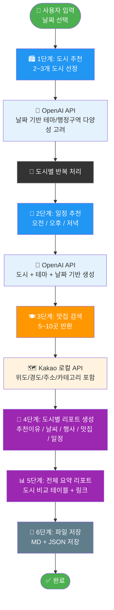

# 🗺️ 국내 여행 추천 프로그램

> OpenAI + Kakao API를 활용한 AI 기반 국내 여행 추천 자동화 시스템

---

## 📌 프로그램 개요

날짜를 입력하면 AI가 자동으로:
1. 여행하기 좋은 국내 도시 **2~3곳** 추천
2. 도시별 **1일 여행 일정** (오전/오후/저녁) 생성
3. 도시별 **맛집 5~10곳** 검색 (위치 정보 포함)
4. 도시별 **상세 리포트** + **전체 요약 리포트** 자동 저장

---

## 🔄 전체 흐름도



---

## 🏗️ 코드 구성

```
travel_planner/
├── travel_planner.py     ← 메인 실행 파일
├── .env                  ← API 키 설정 (Git 제외)
├── .env.example          ← API 키 예시 템플릿
├── requirements.txt      ← 필요 패키지 목록
├── logs/                 ← 실행 로그 저장
│   └── travel_YYYYMMDD.log
└── results/              ← 결과 파일 저장
    ├── summary_YYYY-MM-DD.md
    ├── report_YYYY-MM-DD_도시명.md
    └── raw_YYYY-MM-DD.json
```

### 📄 travel_planner.py 함수 구성

```
travel_planner.py
│
├── CONFIG                      환경변수 로드 (API 키, 경로 설정)
├── parse_args()                CLI 인자 파싱 (--date)
│
├── recommend_cities()          1단계: OpenAI로 도시 2~3개 추천
│   └── OpenAI Chat API 호출
│       └── JSON 파싱 (도시명/행정구역/테마/날씨/행사/추천이유)
│
├── recommend_schedule()        2단계: OpenAI로 1일 일정 생성
│   └── OpenAI Chat API 호출
│       └── JSON 파싱 (오전/오후/저녁 시간/활동/장소/팁)
│
├── search_restaurants()        3단계: Kakao API로 맛집 검색
│   └── Kakao 로컬 API 호출
│       └── 위도/경도/주소/카테고리/URL 파싱
│
├── build_city_report()         4단계: 도시별 Markdown 리포트 생성
│   ├── 추천 지역 & 이유 (표)
│   ├── 날씨 요약
│   ├── 행사/축제 목록
│   ├── 맛집 리스트 (표)
│   └── 1일 일정 (오전/오후/저녁)
│
├── build_summary_report()      5단계: 전체 요약 리포트 생성
│   ├── 도시 비교 테이블
│   └── 도시별 요약 + 상세 리포트 링크
│
├── save_results()              6단계: 파일 저장
│   ├── report_날짜_도시.md (도시별)
│   ├── summary_날짜.md (전체 요약)
│   └── raw_날짜.json (원본 데이터)
│
└── main()                      전체 흐름 제어
```

---

## 📁 결과 파일 구성

### 1. `summary_YYYY-MM-DD.md` - 전체 요약 리포트

```
# 🗺️ YYYY-MM-DD 국내 여행 추천 요약

## 📍 추천 도시 비교
| 도시 | 행정구역 | 테마 | 날씨 | 맛집 수 |
|------|----------|------|------|---------|
| 제주도 | 제주특별자치도 | 자연 | 맑음 25도 | 10곳 |
| 경주  | 경상북도       | 역사 | 맑음 28도 | 8곳  |
| 부산  | 부산광역시     | 해양 | 맑음 27도 | 9곳  |

## 도시별 요약 + 상세 리포트 링크
```

### 2. `report_YYYY-MM-DD_도시명.md` - 도시별 상세 리포트

```
# 최종 여행 리포트: 도시명

1️⃣ 추천 지역 & 추천 이유   ← 도시/행정구역/테마/추천이유 표
2️⃣ 날씨 요약               ← 날씨 한 줄 요약
3️⃣ 행사/축제 목록           ← 해당 날짜 주변 행사
4️⃣ 맛집 리스트              ← 상호명/카테고리/주소/위도/경도/링크
5️⃣ 1일 여행 일정            ← 오전/오후/저녁 활동/장소/팁
```

### 3. `raw_YYYY-MM-DD.json` - 원본 데이터

```json
{
  "date": "2026-08-31",
  "cities": [
    {
      "info": {
        "city": "제주도",
        "region": "제주특별자치도",
        "theme": "자연",
        "weather": "온화하고 맑음, 평균 기온 25도",
        "events": ["제주 바다의 날"],
        "reason": "추천 이유..."
      },
      "schedule": {
        "morning":   { "time": "09:00", "activity": "...", "place": "...", "tip": "..." },
        "afternoon": { "time": "13:00", "activity": "...", "place": "...", "tip": "..." },
        "evening":   { "time": "18:00", "activity": "...", "place": "...", "tip": "..." }
      },
      "restaurants": [
        {
          "place_name": "흑돼지 맛집",
          "category_name": "음식점 > 한식",
          "address_name": "제주시 ...",
          "latitude": 33.123,
          "longitude": 126.456,
          "place_url": "https://place.map.kakao.com/..."
        }
      ]
    }
  ]
}
```

---

## ⚙️ 설치 및 실행

### 1. 패키지 설치

```bash
pip install -r requirements.txt
```

### 2. API 키 설정 (`.env`)

```env
OPENAI_API_KEY=sk-xxxxxxxxxxxxxxxx
KAKAO_REST_API_KEY=xxxxxxxxxxxxxxxx
```

### 3. 실행

```bash
# 날짜 지정 실행
python travel_planner.py --date "2026-08-31"

# 오늘 날짜로 실행 (기본값)
python travel_planner.py
```

---

## 📦 requirements.txt

```
openai
requests
python-dotenv
```

---

## 🔑 API 키 발급

| API | 발급 경로 | 용도 |
|-----|-----------|------|
| OpenAI | https://platform.openai.com | 도시 추천, 일정 생성 |
| Kakao | https://developers.kakao.com | 맛집 검색 (로컬 API) |

---

## 📊 실행 예시

```bash
$ python travel_planner.py --date "2026-08-31"

========================================
✅ 완료!
========================================
추천 도시: 제주도, 경주, 부산

📁 저장된 파일:
   - results/report_2026-08-31_제주도.md
   - results/report_2026-08-31_경주.md
   - results/report_2026-08-31_부산.md
   - results/summary_2026-08-31.md
   - results/raw_2026-08-31.json
========================================
```

---

## ⚠️ 주의사항

- `.env` 파일은 절대 GitHub에 올리지 마세요 (`.gitignore` 등록 필수)
- OpenAI API는 사용량에 따라 비용이 발생합니다
- Kakao API는 일일 호출 한도가 있습니다

---

## 📝 .gitignore 권장 설정

```
.env
logs/
results/
__pycache__/
*.pyc
```