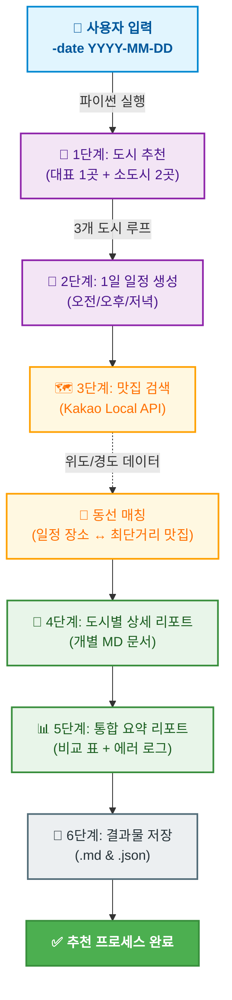

# 🗺️ 국내 여행 추천 프로그램 (v3.2)

> OpenAI(gpt-4o-mini)와 Kakao Local API를 활용한 AI 기반 국내 여행 추천 자동화 시스템입니다. 특정 날짜에 최적화된 국내 대표 명소 1곳과 숨은 소도시 2곳을 추천하고, 하버사인 공식을 이용해 일정별 장소와 가장 가까운 맛집 동선까지 계산하여 여행 리포트를 자동 생성합니다.

---

## 📌 프로젝트 개요

사용자가 입력한 날짜를 기준으로 다음 정보를 자동 생성합니다.

- **여행 추천 도시 3곳** (대표 도시 1곳 + 로컬 소도시 2곳)
- 각 도시별 추천 이유 및 예상 날씨, 축제 정보
- 오전 / 오후 / 저녁 1일 일정
- 카카오 API 기반 맛집 정보 및 **일정 장소와의 최단 거리 매칭**
- 도시별 상세 리포트 및 전체 비교 요약 리포트 (에러 로그 포함)
- **스마트 캐싱(Caching)**을 통한 API 호출 비용 절감 및 원본 JSON 데이터 저장

---

## ✨ 주요 특징

- **날짜 기반 맞춤형 추천**
  - 사용자가 입력한 날짜를 기준으로 계절감과 분위기를 반영한 여행지를 추천합니다.
- **도시 간 비교가 가능한 3개 추천 결과**
  - 대표 도시 1곳과 로컬 소도시 2곳을 함께 제시하여 여행 스타일을 비교할 수 있습니다.
- **정밀한 위치 데이터 및 동선 최적화 (하버사인 공식)**
  - 맛집의 위도/경도 좌표(소수점 5자리)를 수집하고, 일정 장소와의 직선거리(소수점 2자리)를 계산하여 가장 가까운 맛집을 매칭해 줍니다.
- **스마트 캐싱(Caching) 시스템 도입**
  - 동일한 날짜로 재실행할 경우, 기존에 저장된 JSON 데이터를 재사용하여 불필요한 API 호출(비용 및 시간)을 방지합니다.
- **안정적인 에러 핸들링 및 리포트 반영**
  - 특정 API 호출이 실패하더라도 프로그램이 멈추지 않으며(Fault Tolerance), 발생한 에러 내역을 요약 리포트 하단에 기록하여 쉽게 추적할 수 있습니다.
- **환경변수 기반 API 키 관리**
  - 민감한 API 키를 코드에 직접 작성하지 않고 `.env` 파일에서 안전하게 불러옵니다.

---

## 🔄 전체 흐름도



### 📄 프로젝트 구조

```text
travel_planner/
├── travel_planner.py      ← 메인 실행 파일
├── requirements.txt       ← 프로그램 실행에 필요한 외부 파이썬 패키지 목록
├── .env.example           ← API 키 입력 방법을 안내하는 템플릿 파일
├── .env                   ← 실제 API 키가 저장되는 파일 (Git 업로드 제외)
├── logs/                  ← 실행 로그 저장 디렉토리
│   └── run_YYYYMMDD.log
└── results/               ← 결과물 생성 디렉토리
    ├── summary_report_YYYY-MM-DD.md
    ├── report_YYYY-MM-DD_도시명.md
    └── raw_YYYY-MM-DD.json
```

### 🛠 프롬프트 설계 전략
- **JSON 출력 강제**: LLM의 응답을 애플리케이션에서 안정적으로 파싱하고 후속 로직(데이터베이스 저장, UI 렌더링 등)에 활용하기 위해, 추가 텍스트 없이 JSON 배열 형식으로만 응답하도록 설계했습니다. 이는 파싱 에러를 방지하고 시스템의 안정성을 높이기 위함입니다.
---

## ⚙️ 핵심 함수 구성 및 명세

| 함수명 | 입력(Input) | 출력(Output) | 역할 |
|---|---|---|---|
| `parse_args()` | CLI 인자 `-date YYYY-MM-DD` | `argparse.Namespace` | 실행 날짜 파싱 및 형식 검증 |
| `calculate_distance()` | 두 지점의 위도/경도(float) | 직선 거리(km, float) | 하버사인 공식 기반 장소-맛집 간 거리 계산 |
| `get_place_coordinate()` | 장소명 문자열 | `(latitude, longitude)` | 카카오 로컬 API로 장소 좌표 조회 |
| `recommend_cities()` | `date_str`, `errors` | 도시 추천 정보 리스트 | 대표 1곳 + 소도시 2곳 추천 (JSON 강제) |
| `recommend_schedule()` | `city`, `theme`, `date_str`, `errors` | 일정 dict | 도시별 오전/오후/저녁 일정 생성 |
| `search_restaurants()` | `city`, `errors` | 맛집 정보 리스트 | 카카오 API로 도시별 맛집 5~10곳 검색 |
| `build_city_report()` | `date_str`, `city_info`, `schedule`, `restaurants` | Markdown 문자열 | 도시별 상세 리포트 생성 (거리 매칭 포함) |
| `build_summary_report()` | `date_str`, `cities_data`, `global_errors` | Markdown 문자열 | 3개 도시 비교 요약 및 에러 로그 생성 |
| `save_results()` | `date_str`, `cities_data`, `summary_md`, `global_errors` | 저장된 파일 경로 리스트 | Markdown/JSON 결과 파일 최종 저장 |

---

## ⚙️ 설치 및 실행

### 1. 저장소 클론
```bash
git clone <저장소_URL>
cd <프로젝트_폴더명>
```

### 2. 패키지 설치
```bash
pip install -r requirements.txt
```

### 3. 환경변수 설정 (`.env.example` → `.env`)
`.env.example` 파일을 참고하여 `.env` 파일을 생성합니다.
```env
OPENAI_API_KEY=sk-xxxxxxxxxxxxxxxx
KAKAO_REST_API_KEY=xxxxxxxxxxxxxxxx
```
> ⚠️ `.env` 파일은 로컬 개발용으로만 사용하고, 절대 Git 저장소에 업로드하지 마세요.

### 4. 프로그램 실행
```bash
python travel_planner.py -date "2024-10-03"
```
> `-date` 인자는 필수이며 반드시 `YYYY-MM-DD` 형식으로 입력해야 합니다.

---

## 🛠 시스템 설계 및 데이터 처리 전략

1. **프롬프트 설계 (JSON 출력 강제)**
   - LLM의 응답을 애플리케이션에서 안정적으로 파싱하기 위해, 추가 텍스트 없이 완벽한 JSON 배열/객체 형식으로만 응답하도록 프롬프트를 설계했습니다.
2. **GET/POST 통신 방식 분리**
   - 맛집 검색(Kakao)은 단순 데이터 조회를 위해 `GET`을, LLM 요청(OpenAI)은 보안과 긴 프롬프트 전송을 고려해 `POST`를 사용했습니다.
3. **입력 데이터 정규화**
   - LLM이 반환한 도시명에서 '시', '군' 및 불필요한 공백을 정규식(`re.sub`)으로 제거하여 카카오 검색 API의 정확도를 극대화했습니다.
4. **재시도 및 예외 처리 (Fault Tolerance)**
   - API 응답 실패 시 최대 3회 재시도하며, 2회차부터는 JSON 형식을 강조하는 보강 프롬프트를 자동으로 추가합니다.
   - 맛집 정보가 0건이거나 일정 추천에 실패해도 프로그램이 종료되지 않고 기본값을 사용하여 리포트를 정상 출력합니다.
5. **캐싱 전략 (API 비용 절감)**
   - 동일 날짜로 재요청 시, `results/raw_YYYY-MM-DD.json` 파일의 존재 여부를 확인하여 API 호출을 건너뛰고 기존 데이터를 재사용합니다.

---

## 📦 requirements.txt 예시

프로젝트에서 사용하는 주요 패키지는 다음과 같습니다.

```txt
openai
requests
python-dotenv
```

실제 사용 패키지는 `requirements.txt` 파일을 기준으로 관리합니다.

---

## 📝 .gitignore 권장 설정

```gitignore
.env
__pycache__/
results/
*.pyc
```
---


## 🔑 API 키 발급

### 1. OpenAI API 키
- OpenAI 플랫폼에서 발급
- 환경변수 이름: `OPENAI_API_KEY`

### 2. Kakao REST API 키
- Kakao Developers에서 애플리케이션 생성 후 발급
- 환경변수 이름: `KAKAO_REST_API_KEY`

---

## 🔍 트러블슈팅 (Troubleshooting)

API 호출 시 **401 Unauthorized** 또는 **403 Forbidden** 에러가 발생할 경우 다음을 확인하세요.

1. **401 Unauthorized (인증 오류)**
   - `.env` 파일에 API Key가 정확히 입력되었는지, 앞뒤 공백은 없는지 확인하세요.
2. **403 Forbidden (권한 오류)**
   - 해당 API 서비스가 활성화(Enable) 상태인지, 호출 한도(Quota)를 초과하지 않았는지 개발자 콘솔에서 확인하세요.

---

## 📁 결과 파일 구성

실행이 완료되면 `results/` 폴더에 아래 파일들이 생성됩니다.

1. **`report_YYYY-MM-DD_도시명.md`** (도시별 상세 리포트)
   - 도시 기본 정보, 추천 이유, 날씨, 축제
   - 오전/오후/저녁 일정 및 **가장 가까운 맛집 매칭 정보**
   - 맛집 리스트 (상호명, 카테고리, 주소, 좌표, 링크)
2. **`summary_report_YYYY-MM-DD.md`** (전체 요약 리포트)
   - 추천된 3개 도시 비교 테이블
   - 도시별 핵심 요약
   - **시스템 알림 (에러 로그 내역)**
3. **`raw_YYYY-MM-DD.json`** (원본 데이터)
   - 추천 결과, 일정, 맛집, 에러 로그를 모두 담은 캐싱용 원본 데이터

---

## 🚀 향후 개선 아이디어

- 사용자 선호 테마(자연, 먹거리, 감성 등) CLI 인자 추가 (`-theme`)
- 지도 시각화 또는 웹 UI 연동
- 데이터베이스(SQLite/MySQL) 연동을 통한 여행 히스토리 관리

---

## 📚 프로젝트 목적

이 프로젝트는 다음 학습 목표를 바탕으로 제작되었습니다.
- OpenAI API 및 외부 REST API(Kakao) 실전 연동
- 환경변수(`.env`) 기반 비밀정보 관리 및 보안
- JSON 데이터 파싱 및 Markdown 리포트 자동화
- 에러 핸들링, 캐싱, 하버사인 공식을 활용한 알고리즘 구현 경험
- 실사용 가능한 자동화 리포트 생성 경험
```

## 🙌 마무리

이 프로젝트는 생성형 AI와 외부 위치 정보를 결합해  
실제 여행 준비에 활용할 수 있는 자동화 도구를 만드는 데 목적이 있습니다.

코드 품질을 높이기 위해 입력값 검증, 응답 구조 검증, 저장 예외처리 등을 계속 개선할 수 있습니다.