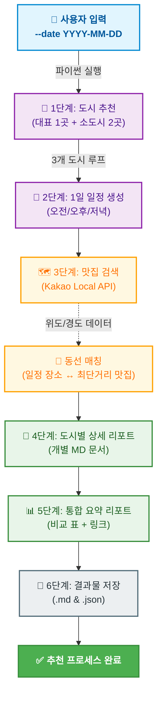

# 🗺️ 국내 여행 추천 프로그램

> OpenAI(gpt-4o-mini) + Kakao Local API를 활용한 AI 기반 국내 여행 추천 자동화 시스템으로, 여행 날짜에 최적화된 국내 대표 명소 및 숨은 소도시를 추천하고 일정별 맛집 동선까지 계산해 리포트를 자동 생성하는 파이프라인입니다.


---


## 📌 프로그램 개요 및 특징

날짜를 입력하면 AI가 계절과 테마를 분석하여 전국 방방곡곡의 맞춤형 여행지와 맛집 동선을 자동으로 설계해 주는 CLI 기반 프로그램입니다.

* **차별화된 3색 도시 구성**
  1곳의 전국 단위 대표 관광지와 2곳의 한적한 숨은 로컬 소도시(군 단위)를 조합하여 다채로운 여행 선택지를 제공합니다.

* **추천 다양성 고도화**
  LLM의 창의성 파라미터(`temperature=0.95`, `presence_penalty=0.6`)를 튜닝하여 고정된 지역 편중을 막고, 매번 새롭고 계절에 맞는 최적의 결과를 유도합니다.

* **장소-맛집 근접 동선 연계**
  1일 시간대별(오전/오후/저녁) 일정에 맞춰, 해당 스팟과 카카오 Local API로 수집된 맛집 간의 직선 거리를 계산해 최단 거리 맛집을 자동으로 매칭합니다.

* **정밀한 위치 데이터 및 실용적 장소 정보**
  맛집의 위도/경도 좌표를 소수점 5자리(약 1.1m 정밀도)로 규격화하고, 카카오맵 별점(rating) 데이터를 함께 수록하여 리포트의 신뢰도를 높였습니다.

* **안정적인 무중단 실행 (Fault Tolerance)**
  API 통신 오류나 LLM의 JSON 파싱 실패 시 최대 3회 자동 재시도 로직이 작동하며, 치명적 오류 시에도 프로그램 멈춤 없이 우회하여 리포트를 정상 발행합니다.

* **다중 포맷 결과물 자동 생성**
  최종 결과물은 가독성 높은 2종의 Markdown 리포트(도시별 상세 리포트 + 전체 요약 리포트)와 모든 파싱 데이터 및 오류 로그가 담긴 JSON 원본 데이터로 나뉘어 `results/` 폴더에 안전하게 저장됩니다.

* **직관적인 CLI 및 입력 검증**
  터미널에서 `-date "YYYY-MM-DD"` 명령어 하나로 구동되며, 날짜 오입력 시 즉각적인 검증 안내를 제공하여 사용자 편의성을 높였습니다.

---

## 🔄 전체 흐름도



### 📄 travel_planner.py 프로젝트 구조

```
travel_planner/
├── travel_planner.py      ← 메인 실행 파일
├── requirements.txt       ← 프로그램 실행에 필요한 외부 파이썬 패키지 목록
├── .env.example           ← API 키 입력 방법을 안내하는 템플릿 파일
├── .env                   ← 실제 API 키가 저장되는 파일 (Git 업로드 제외)
├── logs/                  ← 실행 로그 저장 디렉토리
│   └── run_YYYYMMDD.log
└── results/               ← 결과물 생성 디렉토리
    ├── summary_YYYY-MM-DD.md
    ├── report_YYYY-MM-DD_도시명.md
    └── raw_YYYY-MM-DD.json
```

---

## ⚙️ 핵심 함수 구성

| 함수명 | 역할 |
|---|---|
| `parse_args()` | CLI 실행 인자(`--date`) 파싱 |
| `calculate_distance()` | Haversine 수식을 통한 두 좌표 간 직선 거리(km) 계산 |
| `get_place_coordinate()` | 일정 장소명을 카카오 로컬 API로 검색해 위도/경도 좌표 반환 |
| `recommend_cities()` | OpenAI를 통해 대표 도시 1곳 + 숨은 소도시 2곳 추천 |
| `recommend_schedule()` | OpenAI를 통해 오전/오후/저녁 1일 여행 일정 생성 |
| `search_restaurants()` | Kakao API로 맛집 5~10곳 검색 (별점 및 소수점 5자리 좌표) |
| `build_city_report()` | 맛집 리스트 및 근접 맛집이 연결된 도시별 마크다운 생성 |
| `build_summary_report()`| 추천 도시 비교표가 포함된 전체 요약 마크다운 생성 |
| `save_results()` | 생성된 리포트(.md) 및 원본 데이터(.json) 파일 저장 |
---

---

## 📁 결과 파일 구성

### 1. `summary_YYYY-MM-DD.md` - 전체 요약 리포트

```
# 🗺️ YYYY-MM-DD 국내 여행 추천 요약

## 📍 추천 3개 도시 메타데이터 비교 테이블
| 도시 | 행정구역 | 테마 | 날씨 | 맛집 수 |
|------|----------|------|------|---------|
| 제주도 | 제주특별자치도 | 자연 | 맑음 25도 | 10곳 |
| 경주  | 경상북도       | 역사 | 맑음 28도 | 8곳  |
| 부산  | 부산광역시     | 해양 | 맑음 27도 | 9곳  |

## 도시별 핵심 요약 및 개별 리포트 파일 링크
```

### 2. `report_YYYY-MM-DD_도시명.md` - 도시별 상세 리포트

```
# 최종 여행 리포트: 도시명

1️⃣ 추천 지역 & 추천 이유   ← 도시/행정구역/테마/추천이유 표
2️⃣ 날씨 요약               ← 날씨 한 줄 요약
3️⃣ 행사/축제 목록           ← 해당 날짜 주변 행사
4️⃣ 맛집 리스트              ← 상호명/카테고리/별점/주소/좌표(위도&경도)/링크
5️⃣ 1일 여행 일정 및 알정 정소별 최단 거리 추천 맛집 매팅 표기   ← 오전/오후/저녁 활동/장소/팁
```

### 3. `raw_YYYY-MM-DD.json` - 원본 JSON 데이터
* 추천 정보, 일정, 맛집 전체 파싱 원천 데이터

```json
{
  "date": "2026-08-31",
  "cities": [
    {
      "info": {
        "city": "제주도",
        "region": "제주특별자치도",
        "theme": "자연",
        "weather": "온화하고 맑음, 평균 기온 25도",
        "events": ["제주 바다의 날"],
        "reason": "추천 이유..."
      },
      "schedule": {
        "morning":   { "time": "09:00", "activity": "...", "place": "...", "tip": "..." },
        "afternoon": { "time": "13:00", "activity": "...", "place": "...", "tip": "..." },
        "evening":   { "time": "18:00", "activity": "...", "place": "...", "tip": "..." }
      },
      "restaurants": [
        {
          "place_name": "흑돼지 맛집",
          "category_name": "음식점 > 한식",
          "address_name": "제주시 ...",
          "latitude": 33.123,
          "longitude": 126.456,
          "place_url": "https://place.map.kakao.com/..."
        }
      ]
    }
  ]
}
```

---

## ⚙️ 설치 및 실행

### 1. 패키지 설치(requirements.txt)
requirements.txt 파일에는 이 프로그램이 작동하기 위해 필요한 외부 라이브러리(OpenAI, dotenv 등)의 목록이 적혀 있습니다. 터미널에 아래 명령어를 입력하면 필요한 패키지가 한 번에 설치됩니다

```bash
pip install -r requirements.txt
```

### 2. 환경변수 설정 (.env.example ➔ .env)
.env.example 파일은 어떤 API 키가 필요한지 보여주기 위한 '예시(템플릿)' 파일입니다. 실제 키를 설정하려면 다음 과정을 거쳐야 합니다.

프로젝트 폴더에 .env 라는 이름의 새 파일을 만듭니다. (또는 .env.example을 복사하여 .env로 이름을 변경합니다.)

발급받은 실제 API 키를 .env 파일 안에 붙여넣고 저장합니다.

```env
OPENAI_API_KEY=sk-xxxxxxxxxxxxxxxx
KAKAO_REST_API_KEY=xxxxxxxxxxxxxxxx
```

### 3. 프로그램 실행

```bash
# 날짜 지정 실행
python travel_planner.py --date "2026-08-31"

# 오늘 날짜로 실행 (기본값)
python travel_planner.py
```

---

## 📦 requirements.txt

```
openai
requests
python-dotenv
```

---

## 🔑 API 키 발급

| API | 발급 경로 | 용도 |
|-----|-----------|------|
| OpenAI | https://platform.openai.com | 도시 추천, 일정 생성 |
| Kakao | https://developers.kakao.com | 맛집 검색 (로컬 API) |

---

## 📊 실행 예시

```bash
$ python travel_planner.py --date "2026-08-31"

========================================
✅ 완료!
========================================
추천 도시: 제주도, 경주, 부산

📁 저장된 파일:
   - results/report_2026-08-31_제주도.md
   - results/report_2026-08-31_경주.md
   - results/report_2026-08-31_부산.md
   - results/summary_2026-08-31.md
   - results/raw_2026-08-31.json
========================================
```

---

## ⚠️ 주의사항

- `.env` 파일은 절대 GitHub에 올리지 마세요 (`.gitignore` 등록 필수)
- OpenAI API는 사용량에 따라 비용이 발생합니다
- Kakao API는 일일 호출 한도가 있습니다

---

## 📝 .gitignore 권장 설정

```
.env
logs/
results/
__pycache__/
*.pyc
```