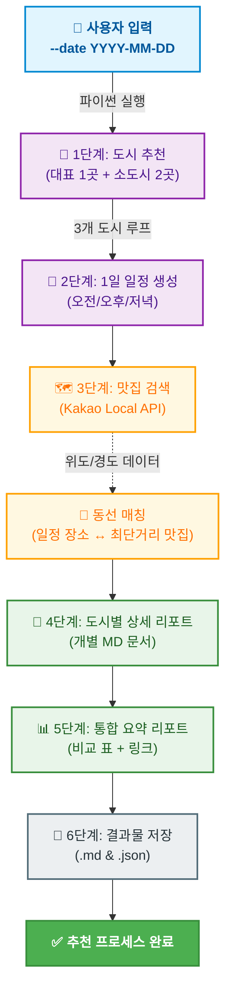

# 🗺️ 국내 여행 추천 프로그램

> OpenAI(gpt-4o-mini)와 Kakao Local API를 활용한 AI 기반 국내 여행 추천 자동화 시스템으로, 특정 날짜에 최적화된 국내 대표 명소 1곳과 숨은 소도시 2곳을 추천하고 일정별 맛집 동선까지 계산해 여행 리포트를 자동 생성하는 프로그램입니다.

---


## 📌 프로젝트 개요

사용자가 입력한 날짜를 기준으로 다음 정보를 자동 생성합니다.

- 여행 추천 도시 3곳
  - 대표 도시 1곳
  - 로컬 소도시 2곳
- 각 도시별 추천 이유
- 오전 / 오후 / 저녁 일정
- 맛집 정보
- 도시별 상세 리포트 및 전체 비교 요약 리포트
- 원본 JSON 데이터 저장

---

## ✨ 주요 특징

- **날짜 기반 여행 추천**
  - 사용자가 입력한 날짜를 기준으로 계절감과 분위기를 반영한 여행지를 추천합니다.

- **도시 간 비교가 가능한 3개 추천 결과**
  - 대표 도시 1곳과 로컬 소도시 2곳을 함께 제시하여 여행 스타일을 비교할 수 있습니다.

- **도시별 1일 일정 자동 생성**
  - 오전 / 오후 / 저녁 일정으로 구성된 실용적인 여행 계획을 제공합니다.

- **정밀한 위치 데이터 및 실용적 장소 정보**
  - 맛집의 위도/경도 좌표를 정리하고, 상호명/카테고리/주소/링크 등 실제 탐색에 필요한 정보를 함께 수록합니다.

- **Markdown + JSON 결과 저장**
  - 사람이 읽기 쉬운 Markdown 리포트와 후처리 가능한 JSON 데이터를 동시에 저장합니다.

- **환경변수 기반 API 키 관리**
  - 민감한 API 키를 코드에 직접 작성하지 않고 `.env` 파일 또는 운영 환경변수에서 불러옵니다.


---

## 🔄 전체 흐름도



### 📄 프로젝트 구조

```
travel_planner/
├── travel_planner.py      ← 메인 실행 파일
├── requirements.txt       ← 프로그램 실행에 필요한 외부 파이썬 패키지 목록
├── .env.example           ← API 키 입력 방법을 안내하는 템플릿 파일
├── .env                   ← 실제 API 키가 저장되는 파일 (Git 업로드 제외)
├── logs/                  ← 실행 로그 저장 디렉토리
│   └── run_YYYYMMDD.log
└── results/               ← 결과물 생성 디렉토리
    ├── summary_YYYY-MM-DD.md
    ├── report_YYYY-MM-DD_도시명.md
    └── raw_YYYY-MM-DD.json
```

---

## ⚙️ 핵심 함수 구성

| 함수명 | 설명 |
|---|---|
| `parse_args()` | CLI 인자에서 여행 날짜를 입력받고 형식을 검증 |
| `calculate_distance()` | 두 좌표 사이의 거리 계산 |
| `get_place_coordinate()` | 장소명으로 위도/경도 조회 |
| `recommend_cities()` | 여행 날짜 기반으로 3개 도시 추천 |
| `recommend_schedule()` | 도시별 오전/오후/저녁 일정 생성 |
| `search_restaurants()` | Kakao API로 도시별 맛집 검색 |
| `build_city_report()` | 도시별 상세 Markdown 리포트 생성 |
| `build_summary_report()` | 3개 도시 비교 요약 리포트 생성 |
| `save_results()` | Markdown/JSON 결과 파일 저장 |

---

## 🧾 함수별 입력/출력 명세

### `parse_args()`
- 입력: CLI 인자 `--date YYYY-MM-DD`
- 출력: `argparse.Namespace`
- 역할: 실행 날짜를 파싱하고 날짜 형식을 검증합니다.

### `calculate_distance(lat1, lon1, lat2, lon2)`
- 입력: 두 지점의 위도/경도(float)
- 출력: 두 좌표 사이의 직선 거리(km, float)
- 역할: 일정 장소와 맛집 간의 거리 비교에 사용합니다.

### `get_place_coordinate(place_name)`
- 입력: 장소명 문자열
- 출력: `(latitude, longitude)` 튜플 또는 `None`
- 역할: 카카오 로컬 API로 장소 좌표를 조회합니다.

### `recommend_cities(date_str, errors=None)`
- 입력:
  - `date_str`: 여행 날짜 문자열 (`YYYY-MM-DD`)
  - `errors`: 오류 기록용 리스트(선택)
- 출력: 도시 추천 정보 리스트
- 역할: 대표 도시 1곳과 로컬 소도시 2곳을 추천합니다.

### `recommend_schedule(city, theme, date_str, errors=None)`
- 입력:
  - `city`: 도시명
  - `theme`: 여행 테마
  - `date_str`: 여행 날짜
  - `errors`: 오류 기록용 리스트(선택)
- 출력: 오전/오후/저녁 일정 dict
- 역할: 도시별 1일 일정을 생성합니다.

### `search_restaurants(city, errors=None)`
- 입력:
  - `city`: 도시명
  - `errors`: 오류 기록용 리스트(선택)
- 출력: 맛집 정보 리스트
- 역할: 카카오 API로 도시별 맛집 후보를 조회합니다.

### `build_city_report(date_str, city_info, schedule, restaurants)`
- 입력:
  - `date_str`: 여행 날짜
  - `city_info`: 도시 메타데이터 dict
  - `schedule`: 일정 정보 dict
  - `restaurants`: 맛집 리스트
- 출력: Markdown 문자열
- 역할: 도시별 상세 리포트를 생성합니다.

### `build_summary_report(date_str, cities_data)`
- 입력:
  - `date_str`: 여행 날짜
  - `cities_data`: 도시별 결과 리스트
- 출력: Markdown 문자열
- 역할: 전체 비교 요약 리포트를 생성합니다.

### `save_results(date_str, cities_data, global_errors)`
- 입력:
  - `date_str`: 여행 날짜
  - `cities_data`: 도시별 결과 리스트
  - `global_errors`: 전체 오류 리스트
- 출력:
  - 저장 성공 시 `True`
  - 저장 실패 시 `False`
- 역할:
  - 도시별 Markdown 리포트 저장
  - 전체 요약 리포트 저장
  - 원본 JSON 데이터 저장
  - 저장 실패 시 오류를 기록합니다.

---

## ⚙️ 설치 및 실행

### 1. 저장소 클론

```bash
git clone <저장소_URL>
cd <프로젝트_폴더명>
```

### 2. 패키지 설치

```bash
pip install -r requirements.txt
```

### 3. 환경변수 설정 (`.env.example` → `.env`)

`.env.example` 파일을 참고하여 `.env` 파일을 생성합니다.

```env
OPENAI_API_KEY=sk-xxxxxxxxxxxxxxxx
KAKAO_REST_API_KEY=xxxxxxxxxxxxxxxx
```

`.env` 파일은 로컬 개발용으로만 사용하고, Git 저장소에는 포함하지 않습니다.

### 4. 프로그램 실행

```bash
python travel_planner.py --date "2026-08-31"
```

> `--date` 인자는 필수이며 `YYYY-MM-DD` 형식으로 입력해야 합니다.

---

## 📦 requirements.txt 예시

프로젝트에서 사용하는 주요 패키지는 다음과 같습니다.

```txt
openai
requests
python-dotenv
```

실제 사용 패키지는 `requirements.txt` 파일을 기준으로 관리합니다.

---

## 🔑 API 키 발급

### 1. OpenAI API 키
- OpenAI 플랫폼에서 발급
- 환경변수 이름: `OPENAI_API_KEY`

### 2. Kakao REST API 키
- Kakao Developers에서 애플리케이션 생성 후 발급
- 환경변수 이름: `KAKAO_REST_API_KEY`

---

## 📁 결과 파일 구성

실행이 완료되면 `results/` 폴더에 아래 파일들이 생성됩니다.

### 1) `report_YYYY-MM-DD_도시명.md`
도시별 상세 여행 리포트입니다.

포함 내용:
1. 도시 기본 정보
2. 추천 이유
3. 오전 / 오후 / 저녁 일정
4. 맛집 리스트 (상호명 / 카테고리 / 주소 / 좌표 / 링크)

### 2) `summary_YYYY-MM-DD.md`
추천된 3개 도시를 비교한 전체 요약 리포트입니다.

### 3) `raw_YYYY-MM-DD.json`
도시 추천 결과, 일정 정보, 맛집 정보, 오류 로그 등을 담은 원본 데이터 파일입니다.

```

## 📊 실행 예시

```bash
python travel_planner.py --date "2026-10-03"
```

예상 결과:
- 3개 도시 추천
- 도시별 일정 생성
- 도시별 맛집 정보 수집
- `results/` 폴더에 Markdown/JSON 파일 저장

---

## ⚠️ 예외처리 및 주의사항

- 날짜는 반드시 `YYYY-MM-DD` 형식으로 입력해야 합니다.
- OpenAI API 응답이 예상 형식과 다를 경우 예외가 발생할 수 있습니다.
- Kakao API 검색 결과가 부족하면 일부 장소 또는 맛집 정보가 비어 있을 수 있습니다.
- 외부 API 호출 실패, 응답 지연, 네트워크 오류가 발생할 수 있습니다.
- 결과 파일 저장 중 오류가 발생할 수 있으므로 저장 실패 여부를 확인해야 합니다.

---

## 환경변수 및 보안 주의사항

이 프로젝트는 API 키를 코드에 직접 작성하지 않고 `.env` 파일 또는 운영 환경변수에서 불러옵니다.

예시:
```env
OPENAI_API_KEY=your_openai_api_key_here
KAKAO_REST_API_KEY=your_kakao_rest_api_key_here

---

주의사항:
- `.env` 파일은 절대 GitHub에 업로드하지 않습니다.
- `.env.example`에는 실제 키가 아닌 예시 값만 넣습니다.
- API 키가 노출되었다면 즉시 재발급해야 합니다.
- 배포 환경에서는 `.env` 파일보다 서버 환경변수 설정 사용을 권장합니다.

---

## 📝 .gitignore 권장 설정

```gitignore
.env
__pycache__/
results/
*.pyc
```
---

## 🚀 향후 개선 아이디어

- 도시 추천 결과의 형식 검증 강화
- 일정 데이터 구조 검증 로직 추가
- 저장 실패 시 재시도 또는 상세 오류 메시지 제공
- 사용자 선호 테마(자연, 먹거리, 역사, 감성 등) 직접 입력 기능 추가
- 지도 시각화 또는 웹 UI 연동

---

## 📚 프로젝트 목적

이 프로젝트는 다음 학습 목표를 바탕으로 제작되었습니다.

- OpenAI API 활용
- 외부 REST API 연동
- 환경변수 기반 비밀정보 관리
- JSON/Markdown 데이터 처리
- 예외처리 및 결과 저장 구조 설계
- 실사용 가능한 자동화 리포트 생성 경험

---

## 🙌 마무리

이 프로젝트는 생성형 AI와 외부 위치 정보를 결합해  
실제 여행 준비에 활용할 수 있는 자동화 도구를 만드는 데 목적이 있습니다.

코드 품질을 높이기 위해 입력값 검증, 응답 구조 검증, 저장 예외처리 등을 계속 개선할 수 있습니다.